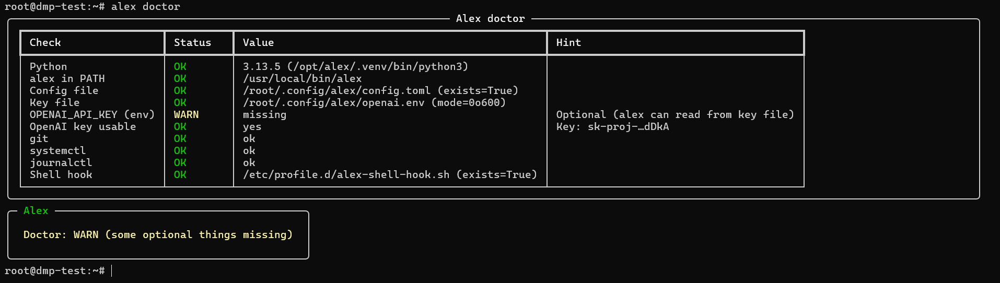
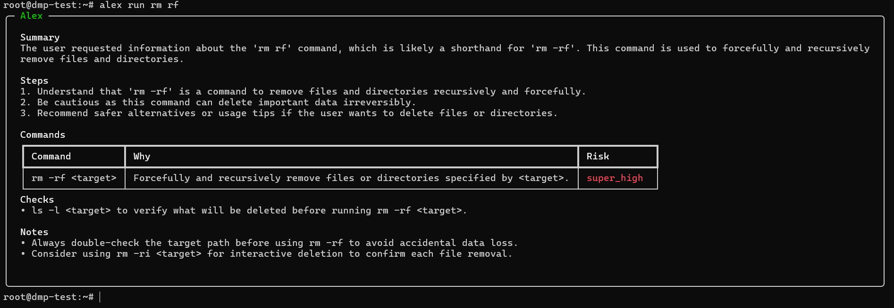
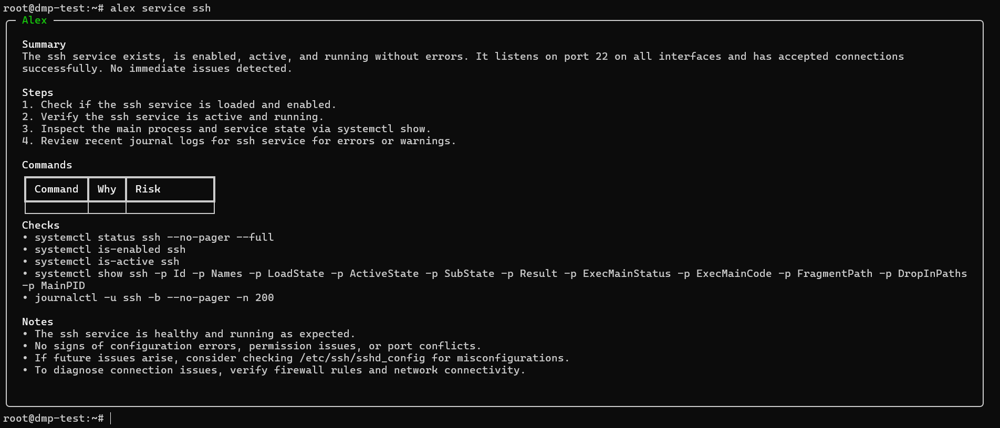

# 🤖 Alex CLI (v0.2.0)
> **Your intelligent Debian assistant that understands your terminal, monitors for errors, and keeps your system safe.**

Alex is a structured CLI assistant built for Debian-based systems. It doesn't just run commands—it understands your environment, captures failed execution details in real-time via shell hooks, and provides AI-powered diagnostics.

## ✨ Key Features

* **🔍 Smart Service Diagnostics:** Unlike basic status checks, Alex performs iterative investigations. It probes logs, ports, and configs until it finds the root cause of a service failure.
* **🧠 Real-time Error Analysis:** With a native shell hook, Alex automatically logs failed commands to `/tmp/alex_last_error.txt`. Run `alex error` to get an instant explanation and fix.
* **🛡️ Built-in Safety Guardrails:** Alex protects you from dangerous operations. It identifies high-risk commands (like destructive `rm`, `mkfs`, or unauthorized redirects) and requires manual confirmation.
* **🏥 Comprehensive System Doctor:** Verify your environment, OpenAI key status, and file permissions at a glance.
* **💸 Token Efficient:** Designed to be lightweight. You can run Alex for weeks on a basic $5 OpenAI credit; the model usage is optimized to save you money.

## 📸 Showcasing Alex

### The "Doctor" Check
Keep your environment healthy. Alex checks everything from Python versions to shell hook status.


### Safety First
Alex identifies high-risk commands and forces a manual confirmation before execution.


### Intelligent Service Diagnosis
Diving deep into systemd units to explain why a service isn't behaving.


## 🚀 Installation

```bash
sudo apt update && sudo apt install -y git && \
sudo git clone [https://github.com/mrazeekk/alex-cli.git](https://github.com/mrazeekk/alex-cli.git) /opt/alex && \
sudo /opt/alex/scripts/install.sh
